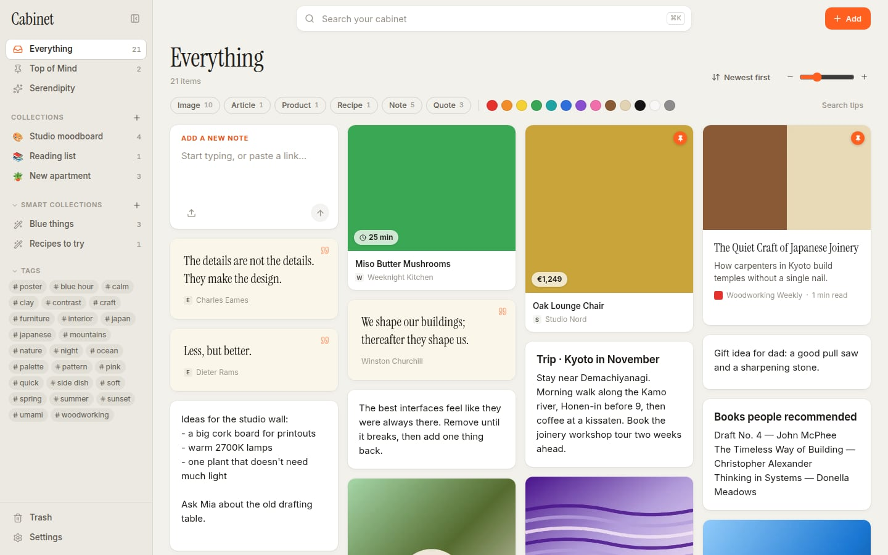
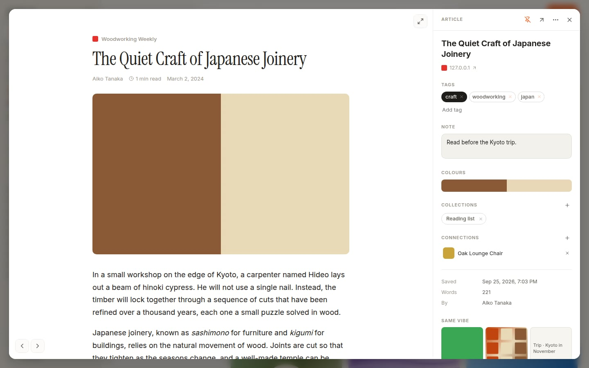
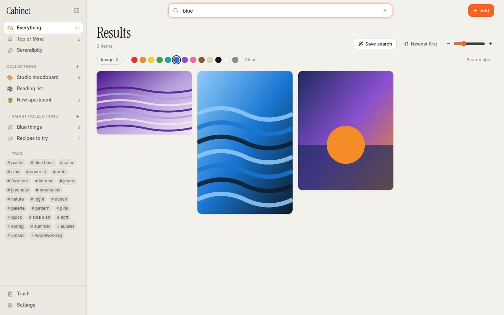
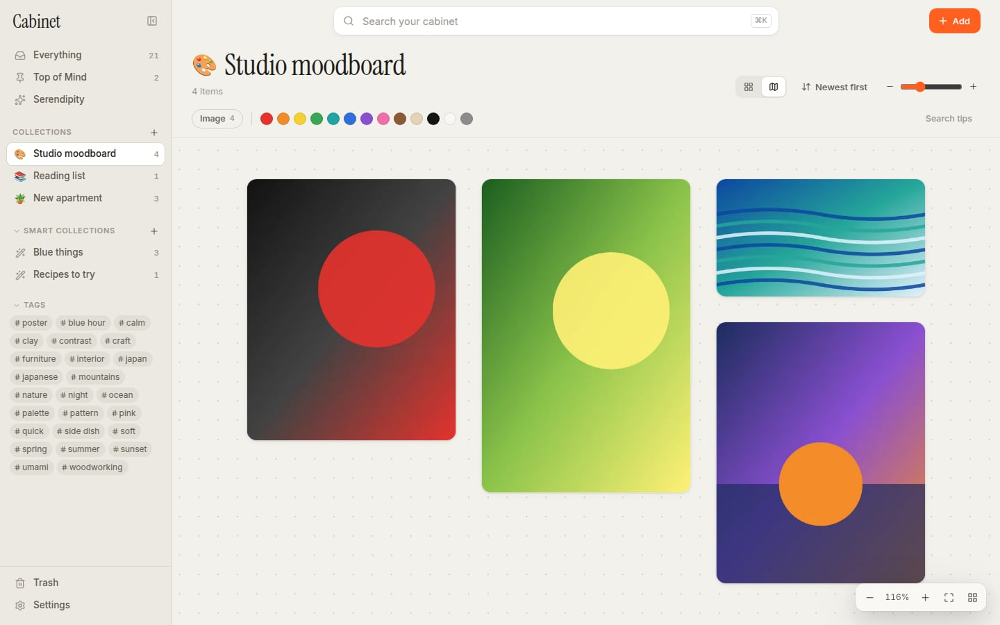
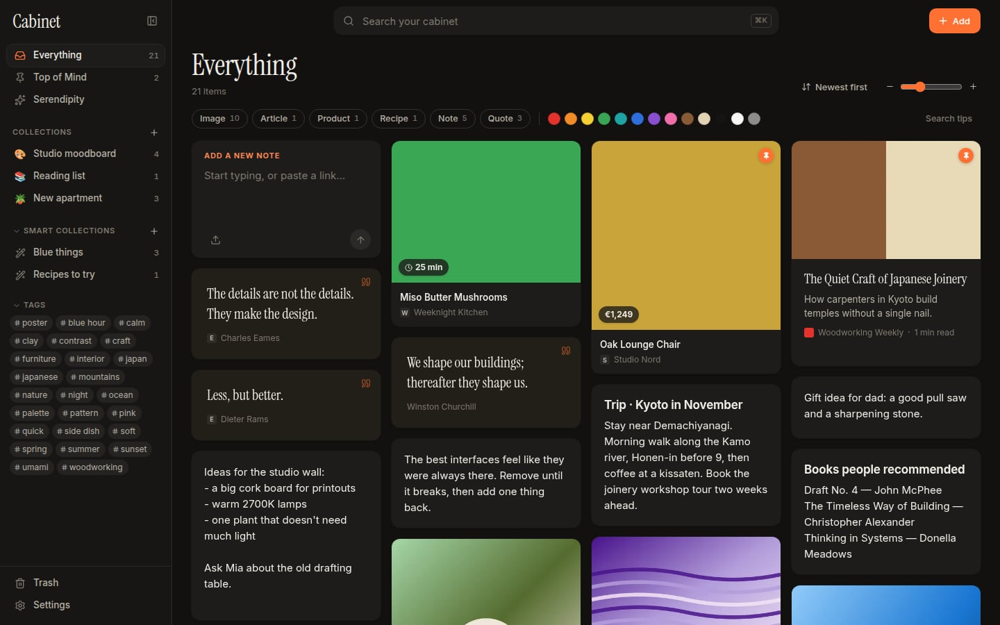

# Cabinet

A private, local-first home for everything you want to remember: images,
links, articles, products, recipes, notes, quotes, videos and PDFs. Save
anything without filing it, then find it again by what it says, what it looks
like, where it came from or when you saved it.

Cabinet is inspired by [mymind](https://mymind.com) ("remember everything,
organise nothing") and [Atlas for Mac](https://atlasformac.com) (a fast,
local visual library). See [docs/RESEARCH.md](docs/RESEARCH.md) for what each
does and how Cabinet compares.



## Features

**Save anything, from anywhere**
- Paste (⌘V) links, images, screenshots or text anywhere in the window.
- Drag files, images and links in from Finder or a browser.
- Write notes in the first card of the grid.
- Browser extension: right-click to save a page, link, image, video or
  selected text; toolbar button saves the page with a snapshot; ⌥-click any
  image; ⌥⇧S saves the current page.
- Menu-bar icon: drop files or text on it. ⌘⌥S saves whatever is on the
  clipboard, from any app.
- Import browser bookmarks (HTML) or CSV exports from Pocket, Raindrop,
  Instapaper. Folders become tags.

**It organises itself**
- Links are recognised as articles, products (price, brand, stock), recipes
  (time, servings, ingredients), videos, books, music, code repositories,
  posts and places, and shown as the right kind of card.
- Articles are saved in full for a clean reader view and full-text search,
  and preview images are kept locally, so nothing disappears when a site does.
- Every image gets a colour palette; pages without an image get a snapshot.
- Optional AI (your own Anthropic key): tags, summaries, descriptions of
  images and the text inside them, so a screenshot is found by what it says.

**Find it again**
- One search box: words, `#tags`, colours (`red`, `color:#ff6600`), types
  (`images`, `type:article`), sites (`site:github.com`), dates (`date:week`,
  `after:2024-01`), `has:note`, `is:pinned`, `"phrases"`, `-exclusions`.
- Filter chips for types and colours; results ranked by relevance.
- "Same vibe": similar items by tags, colours, site and words.
- ⌘K command palette for items, collections, tags and actions.

**Arrange and revisit**
- Collections (drag cards onto them) and smart collections (a saved search
  that fills itself).
- A freeform canvas per collection: pan, zoom, drag and resize.
- Top of Mind for things to keep in view; Serendipity resurfaces forgotten
  items one at a time so you can keep or forget them.
- Connections between items, notes on every item, markdown notes with a
  focus mode, trash with undo.
- Light and dark themes; adjustable card size; fast with many thousands of
  items.

| Reader | Search by colour |
| --- | --- |
|  |  |
| **Canvas** | **Dark** |
|  |  |

## Your data

Everything lives in a folder on your computer (`~/Cabinet Library` by
default, changeable in Settings): a SQLite database and your original files,
named by content hash. There is no account and no server. Nothing leaves your
computer except fetching the pages you save, and, only if you turn it on,
the AI requests to Anthropic made with your own key.

Cabinet is built for cross-device sync and S3-compatible cloud storage later:
every change is logged with a hybrid logical clock and files are
content-addressed. The plan is in [docs/SYNC.md](docs/SYNC.md).

## Getting started

Requirements: Node.js 22.13 or newer (it uses the built-in `node:sqlite`),
and npm. On macOS, Xcode command line tools are not needed.

```bash
cd cabinet
npm install
npm run build
npm start            # opens the desktop app
```

Other ways to run it:

```bash
npm run dev          # library server + UI with hot reload at http://localhost:5173
npm run dev:electron # the same inside the desktop app
npm run serve        # headless server; open http://127.0.0.1:47600 in any browser
npm run seed         # add sample content to the development library used by `npm run dev`
```

Build an installable app (`release/`):

```bash
npm run dist         # .dmg and .zip on macOS, .exe on Windows, AppImage on Linux
```

The macOS build is unsigned; the first time, right-click the app and choose
Open. Signing and notarisation need an Apple Developer ID (see the
electron-builder docs).

### Browser extension

1. Open `chrome://extensions` (Chrome, Edge, Brave or Arc) and turn on
   Developer mode.
2. Click **Load unpacked** and choose the `cabinet/extension` folder.
3. In Cabinet, open **Settings → Browser extension**, copy the address and
   key into the extension's options, and press **Save and test**.

### AI (optional)

Settings → AI: paste an Anthropic API key, choose a model (Claude Opus 5 by
default; Sonnet 5 and Haiku 4.5 are faster and cheaper) and turn it on. New
items are analysed in the background; **Analyse existing items** backfills
the rest. The key is stored in this computer's app settings, never in the
library folder.

## Keyboard shortcuts

| Keys | Action |
| --- | --- |
| ⌘K | Command palette |
| / | Search |
| N | New note |
| ⌘V | Save what's on the clipboard |
| ⌘O | Add files |
| ⌘⌥S | Save the clipboard from any app (desktop) |
| ← → | Previous / next item in the item view |
| P | Pin or unpin the open item |
| ⌫ | Move the open or selected items to the trash |
| ⌘-click, ⇧-click | Select several cards |
| ⌘A | Select everything shown |
| Esc | Close / clear selection |
| ⌘\\ | Show or hide the sidebar |
| ⌘, | Settings |

## Development

```bash
npm test             # Vitest: library, search, enrichment, HTTP API, AI (43 tests)
npm run typecheck
```

Project layout and internals are described in
[docs/ARCHITECTURE.md](docs/ARCHITECTURE.md). In short: an Electron shell
runs a Fastify server bound to 127.0.0.1 around a SQLite library; the React
UI, the browser extension and the headless server all use the same HTTP API.

## Roadmap

- Sync between devices and S3-compatible storage ([design](docs/SYNC.md))
- On-device semantic image search (CLIP) so it works without an API key
- iOS share extension and app
- MCP server so AI assistants can search and add to the library
- Connected folders (browse a folder in place) and Eagle import
